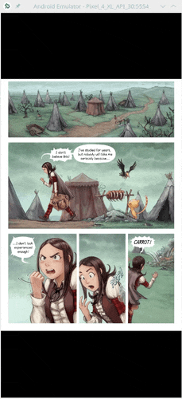
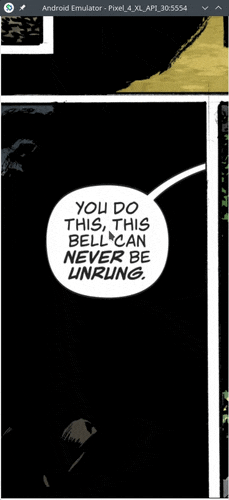
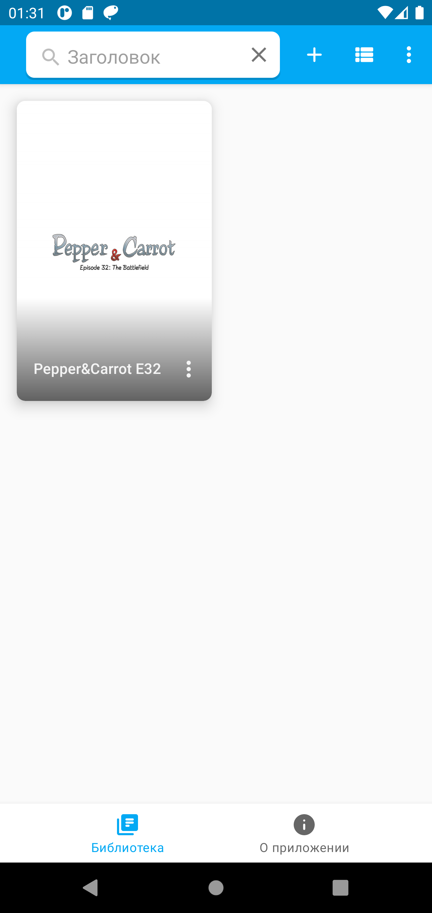
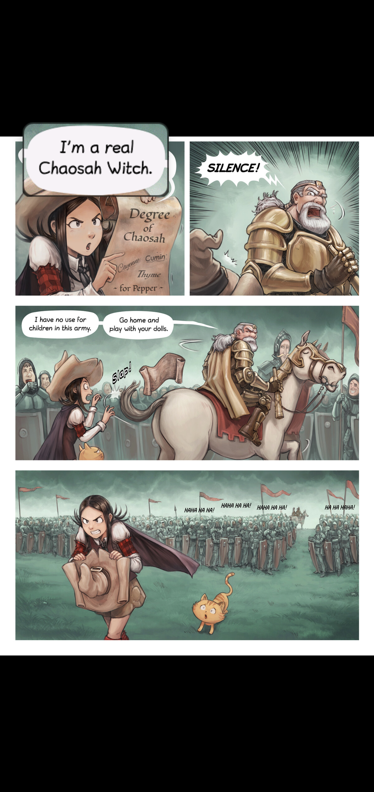
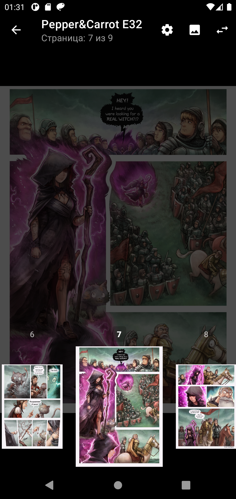
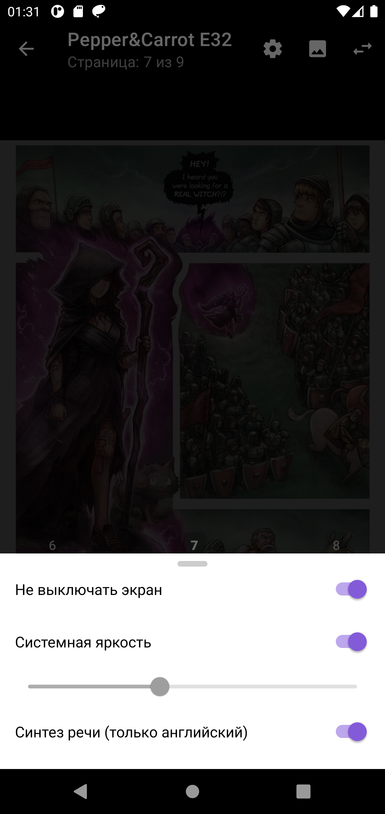
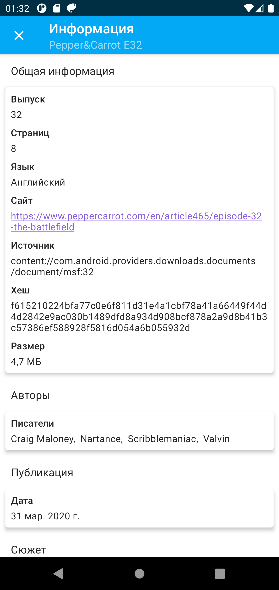
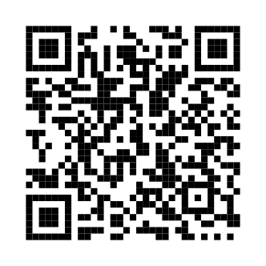
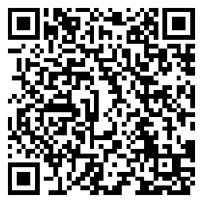

<p align="center"></p>
<h1 align="center"><b><a href="https://seeneva.app">Seeneva</a></b></h1>
<h4 align="center">Свободное Android смарт приложение для чтения комиксов.</h4>
<p align="center"><a href="https://play.google.com/store/apps/details?id=app.seeneva.reader"></a></p>
<div align="center">

**Перевод**: [*English*](README.md)

**•**

[**•** *Возможности*](#возможности)
[**•** *Увеличение речевых балунов*](#увеличение-речевых-балунов)
[**•** *OCR и TTS*](#ocr-и-tts)
[**•** *Производительность*](#производительность)
[**•** *Разрешения*](#разрешения)
[**•** *Скриншоты*](#скриншоты)
[**•** *Что дальше?*](#что-дальше)
[**•** *Разработка*](docs/DEVELOPING-ru.md)
[**•** *Помощь проекту*](#помощь-проекту)
[**•** *Перевод*](#перевод)
[**•** *Донат*](#донат)
[**•** *ЧАВО*](#чаво)
[**•** *Политика конфиденциальности*](#политика-конфиденциальности)
[**•** *Лицензия*](#лицензия)

**•**

[](https://t.me/joinchat/VqnXJZQlTcpiMGVk)
[](https://twitter.com/Seeneva_app)

</div>

---

:exclamation:**Примечание:** Текущий релиз следует считать публичной бетой.

## Возможности

- Умное [увеличение речевых балунов](#увеличение-речевых-балунов). :speech_balloon:
- [***OCR*** и ***TTS***](#ocr-и-tts) речевых балунов. :eyes:
- Поддержка ***CBZ*** (.zip), ***CBR*** (.rar) с [ограничениями](https://github.com/Seeneva/seeneva-reader-android/issues/23), ***CB7*** (.7z), ***CBT*** (.tar) и ***PDF*** в качестве источников комиксов.
- Поддержка различныx [форматов изображений](https://github.com/image-rs/image#supported-image-formats) на любом Android устройстве.
- Просмотр ***ComicRack метаданных***, используя файл `ComicInfo.xml`.
- Поддержка режимов чтения слева направо (LTR) справа налево (RTL).
- Поддержка Android ***4.1+*** и всех Android ABIs: ***arm64-v8a***, ***armeabi-v7a***, ***x86_64*** и ***x86***.
- Умные возможности приложения доступны локально на самом устройстве.
- Свободное приложение под GPLv3 or later [лицензией](#лицензия).
- Не содержит рекламы, не собирает персональных данных.
- Всё ещё не впечатляет? Эй, на иконке милый кит-балун! :whale2:

## Увеличение речевых балунов

Каждый раз, когда вы добавляете новый комикс в библиотеку приложения, оно начинает сканировать каждую страницу в поисках речевых балунов, используя модель машинного обучения (основанную на [YOLOv4-tiny](https://github.com/AlexeyAB/darknet)).

Теперь вы можете легко увеличивать и переходить между речевыми балунами комикса вне зависимости от того насколько маленький экран вашего устройства:



:exclamation:**Примечание:**

- Используйте изображения страниц высокого разрешения для более точного распознавания.  
- ML модель была натренирована на ~10K речевых балунах из современных комиксов и манги. Результат распознавания очень хороший, но всё же вы можете столкнуться с проблемами, например, неверного порядка чтения балунов.

## OCR и TTS

Приложение чтения комиксов *Seeneva* позволяет использовать [**O**ptical **C**haracter **R**ecognition](https://ru.wikipedia.org/wiki/%D0%9E%D0%BF%D1%82%D0%B8%D1%87%D0%B5%D1%81%D0%BA%D0%BE%D0%B5_%D1%80%D0%B0%D1%81%D0%BF%D0%BE%D0%B7%D0%BD%D0%B0%D0%B2%D0%B0%D0%BD%D0%B8%D0%B5_%D1%81%D0%B8%D0%BC%D0%B2%D0%BE%D0%BB%D0%BE%D0%B2) (на базе [Tesseract](https://github.com/tesseract-ocr/tesseract)) на всех найденных речевых балунах, чтобы извлечь из их изображения текст. Это позволяет легко копировать текст из балунов и, например, использовать скопированный текст для его перевода в любом приложении-переводчике.



После каждого успешного распознавания текста при помощи OCR, вы можете использовать [**T**ext-**T**o-**S**peech](https://ru.wikipedia.org/wiki/%D0%A1%D0%B8%D0%BD%D1%82%D0%B5%D0%B7_%D1%80%D0%B5%D1%87%D0%B8), чтобы синтезировать человеческую речь из текста речевых балунов. Таким образом возможно использовать приложение *Seeneva*, для прослушивания "аудио" комиксов.

:exclamation:**Примечание:**

- Сейчас поддерживается только английский язык.
- Любой Android TTS engine должен быть установлен на устройстве, чтобы использовать TTS внутри приложения.
- OCR был натренирован на ~2K текстовых строк из [Big Two Comics](https://en.wikipedia.org/wiki/Big_Two_Comics). Результат получился хороший, но разные шрифты дают разный результат распознавания в лучшую или худшую сторону. Иногда текст может вовсе не распознаётся приложением.

## Производительность

Умные возможности приложения при добавлении комикса в библиотеку могут занять время. Скорость обработки комиксов зависит от характеристик процессора устройства, типа источника комикса (например степень сжатия), количества страниц и их размер. Вот несколько примеров с реальных устройств.

| Устройство               | CBR (44 МБ, 24 страниц) | CBR (103 МБ, 78 страниц) |
| ------------------------ | ----------------------- | ------------------------ |
| *Pixel 2 XL*             | ~15 сек                 | ~75 сек                  |
| *Nexus 5*                | ~60 сек                 | ~190 сек                 |
| *Ainol Novo 7 Aurora II* | ~180 сек                | ~600 сек                 |

## Разрешения

*Seeneva* запрашивает следующие Android разрешения для обеспечения корректной работы:

- `android.permission.READ_EXTERNAL_STORAGE`: необходимо на Android версиях вплоть до 4.3. Это разрешение позволяет добавлять в библиотеку файлы комиксов на внешнем хранилище устройства (например SD карта).
- `android.permission.FOREGROUND_SERVICE`: необходимо для обработки добавления комиксов в [foreground Service](https://developer.android.com/guide/components/foreground-services). Каждый комикс проходит через модель машинного обучения, что может занять несколько минут. Foreground Service позволяет *Seeneva* продолжить процесс добавления комиксов без риска быть остановленным системой как только пользователь переведёт приложение в фон.
- `android.permission.WAKE_LOCK`, `android.permission.RECEIVE_BOOT_COMPLETED`: необходимы для библиотеки [AndroidX WorkManager](https://developer.android.com/reference/androidx/work/package-summary). *Seeneva* использует эту библиотеку для периодической синхронизации файлов добавленных комиксов, чтобы определить их статус (например, файл комикса был удалён, переименован или повреждён) и отобразить этот статус пользователю. Эти разрешения позволяют запустить периодическую синхронизацию после того как устройство было перезапущено.

## Скриншоты

[](docs/img/ru/screenshot/Screenshot_1616797877.png)
[](docs/img/ru/screenshot/Screenshot_1616797894.png)
[](docs/img/ru/screenshot/Screenshot_1616797907.png)
[](docs/img/ru/screenshot/Screenshot_1616797916.png)
[](docs/img/ru/screenshot/Screenshot_1616797926.png)
[](docs/img/ru/screenshot/Screenshot_1616797948.png)

## Что дальше?

Больше умных возможностей, новые языки, поддерживающие [OCR](#ocr-и-tts). Идей для реализации много.

Вот некоторые из них:

- [ ] Утилиты для возможности пользователям внести вклад в улучшение ML возможностей.
- [ ] Умный перевод текста в речевых балунах на другой язык.

Следите за обновлениями!

:exclamation: *Seeneva* - это некоммерческий проект, поэтому строгой "дорожной карты" по дням здесь не планируется.

## Помощь проекту

Главной целью проекта сейчас является стабилизация кодовой базы.

Вы можете помочь проекту:

- Открыв новый issue, если поймаете баг.
- [Внести улучшения в код](docs/CODE_CONTRIBUTION-ru.md), используя Pull Request.
- Участвуя в переводе приложения на новые языки или исправляя ошибки в уже существующей локализации с помощью [Weblate](https://hosted.weblate.org/projects/seeneva).
- Рассказав друзьям об этом приложении.
- Отправив [донат](#донат) разработчику.
  
## Перевод

[](https://hosted.weblate.org/engage/seeneva/)

## Донат

*Seeneva* - это свободное, бесплатное, не содержащее рекламы Android смарт приложение для чтения комиксов с открытым исходным кодом. Единственный доход разработчика приложения - это пожертвования от самих пользователей.

Если вам нравится *Seeneva*, то вы можете отправить пожертвование на будущую разработку проекта. Это позволит разработчику улучшить ПК для ускорения разработки или оплатить облачные сервисы для тренировки ML моделей.

*Seeneva* станет ещё умнее, как никогда ранее! :brain:

Пожалуйста помните, что донаты полностью добровольны. Сейчас пожертвования не приносят каких-либо бонусов, кроме признательности разработчика приложения. :heart_eyes_cat:

<table>

<tbody>
<tr>
<td>

[![liberpay_button]][liberpay_link]

</td>
<td>
<p align="center">
    <a href="docs/img/donate/liberapay_qr.png"></a>
</p>
</td>
</tr>
<tr>

<td>

[![qiwi_button]][qiwi_link]

</td>
<td>
<p align="center">
    <a href="docs/img/donate/qiwi_qr.png"></a>
</p>
</td>
</tr>
<tr>

<td>

[![bitcoin_button]][bitcoin_link]

</td>
<td>
<p align="center">
    <a href="docs/img/donate/bitcoin_qr.png"></a>
    <br>
    bc1qka05pst7ls9g<br>8fgdx4wvqr8fsjkwjkmj9jtcp0
</p>
</td>
</tr>
<tr>

<td>

[![nano_button]][nano_link]

</td>
<td>
<p align="center">
    <a href="docs/img/donate/nano_qr.png"></a>
    <br>
    nano_1oyofpnaacs<br>wu4byr4iiw8uwiqt<br>hhq83w4fkhsaujsm<br>restxnf6mzaby86ig
</p>
</td>
</tr>
<tr>

<td>

[![ethereum_button]][ethereum_link]

</td>
<td>
<p align="center">
    <a href="docs/img/donate/ethereum_qr.png"></a>
    <br>
    0xdBa3f438107208<br>837491885351deAB<br>00d66c718B
</p>
</td>
</tr>
</tbody>
</table>

## ЧАВО

**Q**: Что значит слово *Seeneva*?

**A**: Это изменённое слово ["синева"](https://ru.wiktionary.org/wiki/%D1%81%D0%B8%D0%BD%D0%B5%D0%B2%D0%B0). Или же это странная отсылка к [Евангелиону](https://ru.wikipedia.org/wiki/%D0%95%D0%B2%D0%B0%D0%BD%D0%B3%D0%B5%D0%BB%D0%B8%D0%BE%D0%BD_(%D1%80%D0%BE%D0%B1%D0%BE%D1%82)).

**Q**: Где я могу скачать используемый ML датасет?

**A**: Вы не можете этого сделать из-за вероятных проблем с авторским правом. Возможно в будущем появится возможность поделиться им.

**Q**: Почему [увеличение речевых балунов](#увеличение-речевых-балунов) или [OCR](#ocr-и-tts) в моём комиксе работает так плохо?

**A**: Пожалуйста, попробуйте использовать изображения страниц большего разрешения. Если это не помогло, то в этом комиксе содержатся речевые балуны форма или шрифт которых сейчас не поддерживаются приложением. Обычно это может быть исправлено путём добавления этого комикса в процесс обучения моделей ML. Отмечу, что сейчас манга определяется хуже, чем комиксы.

**Q**: В чём разница между **Импортировать** и **Связать** при добавлении комикса?

**A**: Текущая UI реализация добавления комикса не совсем очевидна и может запутать пользователя. Реализация будет изменена в будущих версиях приложения.

Разница между режимами добавления комикса:

- **Импортировать** - файл комикса будет скопирован во внутреннюю папку приложения. Если вы импортируете 100 МБ комикс, то у вас на устройстве будет два одинаковых файла комикса, каждый по 100 МБ. Импортированный комикс всегда будет доступен для чтения в приложении.

- **Связать** - приложение запросит постоянную ссылку на файл комикса с помощью встроенного в Android фреймворка [storage access framework](https://developer.android.com/guide/topics/providers/document-provider). Запрошенный файл будет обработан без копирования, что помогает уменьшить занимаемое приложением место на устройстве. **НО**. Если вы удалите с устройства файловый менеджер, которым была получена ссылка на комикс, *Seeneva* потеряет возможность открывать комикс. Сам файл комикса останется на своём месте.

**Q**: Где мне найти цифровые комиксы?

**A**: Их можно купить, некоторые комиксы, такие как [Pepper&Carrot](https://www.peppercarrot.com/) распространяются бесплатно по свободной лицензии. В любом случае вы можете открыть любой такой комикс в приложении, вне зависимости от того, где он был приобретён, главное чтобы формат поддерживался приложением. Сейчас *Seeneva* распространяется без вшитых комиксов.

## Политика конфиденциальности

Пожалуйста, прочитайте документ [PRIVACY](PRIVACY.md) для большей информации.

## [Лицензия](https://www.gnu.org/licenses/gpl-3.0.html)

<p align="center">
    
</p>

```text
This program is free software: you can redistribute it and/or modify
it under the terms of the GNU General Public License as published by
the Free Software Foundation, either version 3 of the License, or
(at your option) any later version.

This program is distributed in the hope that it will be useful,
but WITHOUT ANY WARRANTY; without even the implied warranty of
MERCHANTABILITY or FITNESS FOR A PARTICULAR PURPOSE.  See the
GNU General Public License for more details.

You should have received a copy of the GNU General Public License
along with this program. If not, see <https://www.gnu.org/licenses/>.
```

### Сторонние зависимости

Список используемых зависимостей и их лицензии могут быть найдены в файле [dependencies.json](logic/src/main/res/raw/dependencies.json). Полный текст любой из лицензий может быть найден в директории [license](app/src/main/assets/license). Также этот список может быть найден на экране "О приложении" внутри самого приложения.

Пожалуйста, дайте мне знать если текст лицензий содержит некорректную информацию!

### Другое

- Некоторые примеры и тесты приложения используют страницы из замечательного веб комикса [Pepper&Carrot](https://www.peppercarrot.com/), распространяющегося под лицензией [CC BY 4.0](https://creativecommons.org/licenses/by/4.0/).

- Google Play и логотип Google Play являются товарными знаками корпорации Google LLC.

[liberpay_button]: https://img.shields.io/static/v1?style=flat&label=Liberapay&message=Donate&logo=liberapay&labelColor=0073A7&color=ECC114 "Liberapay Button"
[liberpay_link]: https://en.liberapay.com/Seeneva/donate

[bitcoin_button]: https://img.shields.io/static/v1?style=flat&label=Bitcoin&message=Donate&logo=bitcoin&labelColor=0073A7&color=F08F19 "bc1qka05pst7ls9g8fgdx4wvqr8fsjkwjkmj9jtcp0"
[bitcoin_link]: bitcoin:bc1qka05pst7ls9g8fgdx4wvqr8fsjkwjkmj9jtcp0

[ethereum_button]: https://img.shields.io/static/v1?style=flat&label=Ethereum&message=Donate&logo=ethereum&logoColor=A4A5FF&labelColor=0073A7&color=A4A5FF "0xdBa3f438107208837491885351deAB00d66c718B"
[ethereum_link]: https://etherscan.io/address/0xdBa3f438107208837491885351deAB00d66c718B

[qiwi_button]: https://img.shields.io/static/v1?style=flat&label=Qiwi&message=Donate&logo=qiwi&labelColor=0073A7&color=FF8100 "Qiwi Button"
[qiwi_link]: https://my.qiwi.com/Sergei-SbvCCGG4D5

[nano_button]: https://img.shields.io/static/v1?style=flat&label=Nano&message=Donate&logo=nano&logoColor=9CE2FF&labelColor=0073A7&color=9CE2FF "nano_1oyofpnaacswu4byr4iiw8uwiqthhq83w4fkhsaujsmrestxnf6mzaby86ig"
[nano_link]: nano://nano_1oyofpnaacswu4byr4iiw8uwiqthhq83w4fkhsaujsmrestxnf6mzaby86ig
