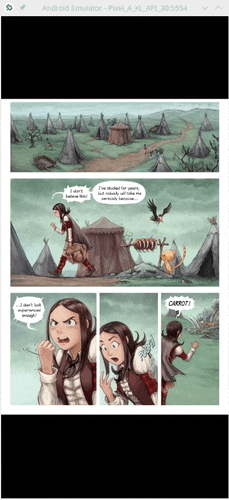
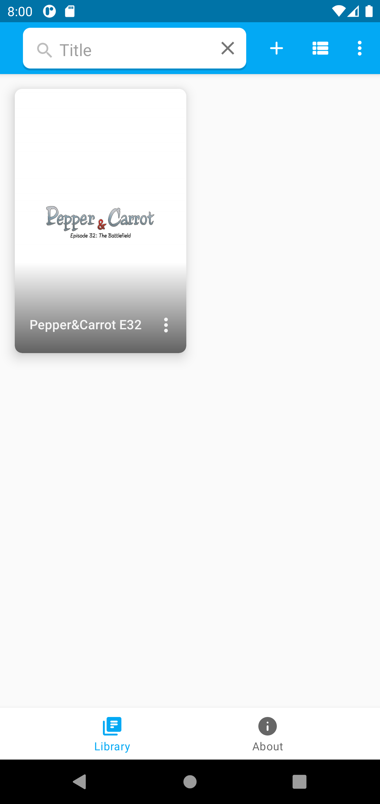
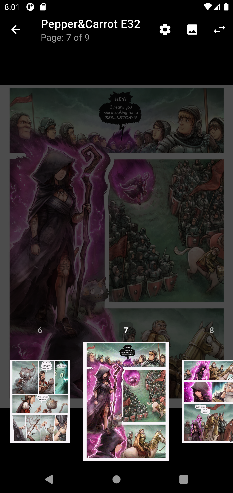

<p align="center"></p>
<h1 align="center"><b><a href="https://seeneva.app">Seeneva</a></b></h1>
<h4 align="center">A libre smart powered comic book reader for Android.</h4>

<p align="center">

<a href="https://play.google.com/store/apps/details?id=app.seeneva.reader">

</a>

<a href="https://f-droid.org/packages/app.seeneva.reader">

</a>

</p>

<div align="center">

**Translation**: [*Русский*](README-ru.md)

**•**

[**•** *Features*](#features)
[**•** *Speech balloons zooming*](#speech-balloons-zooming)
[**•** *OCR and TTS*](#ocr-and-tts)
[**•** *Performance*](#performance)
[**•** *Permissions*](#permissions)
[**•** *Screenshots*](#screenshots)
[**•** *What's next?*](#whats-next)
[**•** *Developing*](docs/DEVELOPING.md)
[**•** *Contribution*](#contribution)
[**•** *Translation*](#translation)
[**•** *Donate*](#donate)
[**•** *FAQ*](#faq)
[**•** *Privacy Policy*](#privacy-policy)
[**•** *License*](#license)

**•**

[](https://t.me/joinchat/VqnXJZQlTcpiMGVk)
[](https://twitter.com/Seeneva_app)

</div>

---

:exclamation:**Note:** Current release should be considered as public beta.

## Features

- Smart [speech balloons zooming](#speech-balloons-zooming). :speech_balloon:
- Speech balloons [***OCR*** and ***TTS***](#ocr-and-tts). :eyes:
- Supports ***CBZ*** (.zip), ***CBR*** (.rar) with [limitations](https://github.com/Seeneva/seeneva-reader-android/issues/23), ***CB7*** (.7z), ***CBT*** (.tar) and ***PDF*** comic book archives.
- Supports different [image formats](https://github.com/image-rs/image#supported-image-formats) on any Android device.
- View ***ComicRack metadata*** (from `ComicInfo.xml` file).
- Supports Left-to-Right (LTR) and Right-to-Left (RTL) read directions.
- Supports Android ***4.1+*** and all available Android ABIs ***arm64-v8a***, ***armeabi-v7a***, ***x86_64*** and ***x86***.
- Smart functionality performs locally on the device.
- Libre application under GPLv3 or later [license](#license).
- No ads, no personal data collection.
- Is it not enough? Hey, there is a bubble-whale on the icon! :whale2:

## Speech balloons zooming

Every time you add a new comic book into the app's library, it will scan each page to find all speech balloons on them using Machine Learning object detection model (based on [YOLOv4-tiny](https://github.com/AlexeyAB/darknet)).

Now you can easily zooming and navigate through comic book speech balloons no matter how small your screen:



:exclamation:**Note:**

- Use high res page images for better recognition.  
- ML model was trained on ~10K speech balloons from modern comic books and manga. The result is really nice but sometimes you may encounter some issues with speech balloons order.

## OCR and TTS

*Seeneva* comic book reader make it possible to use [**O**ptical **C**haracter **R**ecognition](https://en.wikipedia.org/wiki/Optical_character_recognition) (based on [Tesseract](https://github.com/tesseract-ocr/tesseract)) on all founded speech balloons to extract text from them. This will allow you to easily copy speech balloon's text and for example translate it using any available translator.


After every success OCR you can also use [**T**ext-**T**o-**S**peech](https://en.wikipedia.org/wiki/Speech_synthesis) to convert speech balloon's text into synthesized human speech. You can use *Seeneva* like audio comic book reader.

:exclamation:**Note:**

- Only English language is supported right now.
- Any Android TTS engine should be installed on the device to use in-app TTS.
- OCR was trained on ~2K of text lines primarily by [Big Two Comics](https://en.wikipedia.org/wiki/Big_Two_Comics). The result is pretty good but different text fonts may be recognized worse or better than others (or not recognize at all).

## Performance

Smart adding new comic book into the library might take a while. It is depends on your device CPU specifications, comic book archive type, pages count and their size. Here are some examples on real devices.

| Device                   | CBR (44 MB, 24 pages) | CBR (103 MB, 78 pages) |
| ------------------------ | --------------------- | ---------------------- |
| *Pixel 2 XL*             | ~15s                  | ~75s                   |
| *Nexus 5*                | ~60s                  | ~190s                  |
| *Ainol Novo 7 Aurora II* | ~180s                 | ~600s                  |

## Permissions

*Seeneva* requires some Android permissions to run properly:

- `android.permission.READ_EXTERNAL_STORAGE`: required on Android up to 4.3. This permission allows to add into the library comic book files located on device external storage (like SD card).
- `android.permission.FOREGROUND_SERVICE`: required to process comic book adding inside a [foreground Service](https://developer.android.com/guide/components/foreground-services). Each comic book goes through a ML model which can take up to a few minutes. The foreground Service allows *Seeneva* to keep adding comics without the risk of being killed by the OS when the user has placed the app in the background.
- `android.permission.WAKE_LOCK`, `android.permission.RECEIVE_BOOT_COMPLETED`: required by [AndroidX WorkManager](https://developer.android.com/reference/androidx/work/package-summary) library. *Seeneva* uses that library to periodically sync added comic book files to determine their status (e.g. comic book file was removed, renamed or corrupted) and display that status to the user. These permissions allow to start that periodical task after the device has been rebooted.

## Screenshots

[](docs/img/en/screenshot/Screenshot_1616518847.png)
[](docs/img/en/screenshot/Screenshot_1616519900.png)
[](docs/img/en/screenshot/Screenshot_1616518878.png)
[](docs/img/en/screenshot/Screenshot_1616521230.png)
[](docs/img/en/screenshot/Screenshot_1616518933.png)
[](docs/img/en/screenshot/Screenshot_1616519486.png)

## What's next?

More smart features, new supported by [OCR](#ocr-and-tts) languages. Where are a lot of ideas to implement.

Here are some of them:

- [ ] Tools for contributors to improve ML features.
- [ ] Smart speech balloon text translation to another language.

Stay tuned!

:exclamation: *Seeneva* is a non-profit project, so there is no strong road map.

## Contribution

- Open an issue if you catch a bug.
- [Code contribution](docs/CODE_CONTRIBUTION.md) using Pull Request.
- Help translate the app into new languages or correct current localization mistakes using [Weblate](https://hosted.weblate.org/projects/seeneva).
- Tell your friends about the app.
- Also you can support the app by [donation](#donate).

## Translation

[](https://hosted.weblate.org/engage/seeneva/)

## Donate

*Seeneva* is a free and open source comic book reader without any income other than donations from users of the app.

If you like *Seeneva* comic book reader, you can donate to its future development. It will help to upgrade developer's dev machine to faster implement new features or rent cloud services required to train ML models.

So *Seeneva* will be smarter than ever! :brain:

Please remember that donations are totally voluntary. There is no any bonuses right now, except the developer appreciation. :heart_eyes_cat:

<table>

<tbody>
<tr>
<td>

[![liberpay_button]][liberpay_link]

</td>
<td>
<p align="center">
    <a href="docs/img/donate/liberapay_qr.png"></a>
</p>
</td>
</tr>
<tr>

<td>

[![qiwi_button]][qiwi_link]

</td>
<td>
<p align="center">
    <a href="docs/img/donate/qiwi_qr.png"></a>
</p>
</td>
</tr>
<tr>

<td>

[![bitcoin_button]][bitcoin_link]

</td>
<td>
<p align="center">
    <a href="docs/img/donate/bitcoin_qr.png"></a>
    <br>
    bc1qka05pst7ls9g<br>8fgdx4wvqr8fsjkwjkmj9jtcp0
</p>
</td>
</tr>
<tr>

<td>

[![nano_button]][nano_link]

</td>
<td>
<p align="center">
    <a href="docs/img/donate/nano_qr.png"></a>
    <br>
    nano_1oyofpnaacs<br>wu4byr4iiw8uwiqt<br>hhq83w4fkhsaujsm<br>restxnf6mzaby86ig
</p>
</td>
</tr>
<tr>

<td>

[![ethereum_button]][ethereum_link]

</td>
<td>
<p align="center">
    <a href="docs/img/donate/ethereum_qr.png"></a>
    <br>
    0xdBa3f438107208<br>837491885351deAB<br>00d66c718B
</p>
</td>
</tr>
</tbody>
</table>

## FAQ

**Q**: What does the *Seeneva* mean?

**A**: It is a modified Russian word ["синева"](https://en.wiktionary.org/wiki/%D1%81%D0%B8%D0%BD%D0%B5%D0%B2%D0%B0). Or this is a strange reference to [Evangelion](https://en.wikipedia.org/wiki/Evangelion_(mecha)).

**Q**: Where can I download ML dataset?

**A**: You can't because of legal issues. Maybe there will be a way in the future.

**Q**: Why my comic book [speech balloons zooming](#speech-balloons-zooming) or [OCR](#ocr-and-tts) recognition results so poor?

**A**: Please try to use high resolution images. If it doesn't help then your comic book has unsupported speech balloon's shapes or fonts. This usually can be fixed by adding this comic book into ML training process. Also manga recognition is worse than comic book right now.

**Q**: What is the difference between **Import** and **Link** adding options?

**A**: Current adding process is not very clear and can confuse. It should be improved in future versions.

To clarify the difference:

- **Import** - a comic book will be copied into app's internal folder. If you have a 100MB comic book and import it, you will have two identical files of 100MB each. The imported comic book is always available for the app.

- **Link** - the app will request permanent read link to a comic book using Android's [storage access framework](https://developer.android.com/guide/topics/providers/document-provider). The requested comic book will be read from its source folder without any copy. This will help to save free space on a device. **But**. If you uninstall your file manager app which provided this permanent link, *Seeneva* will lose that link as result. Your comic book file won't be corrupted by *Seeneva*.

**Q**: Where I have to get digital comic books?

**A**: You can buy them, some comic books like [Pepper&Carrot](https://www.peppercarrot.com/) are libre. Anyway you can open any comic book by the app while its format is supported. Sorry, but *Seeneva* app ships without prebuild comic books.

## Privacy Policy

Please read the [PRIVACY](PRIVACY.md) document for more information.

## [License](https://www.gnu.org/licenses/gpl-3.0.html)

<p align="center">
    
</p>

```text
This program is free software: you can redistribute it and/or modify
it under the terms of the GNU General Public License as published by
the Free Software Foundation, either version 3 of the License, or
(at your option) any later version.

This program is distributed in the hope that it will be useful,
but WITHOUT ANY WARRANTY; without even the implied warranty of
MERCHANTABILITY or FITNESS FOR A PARTICULAR PURPOSE.  See the
GNU General Public License for more details.

You should have received a copy of the GNU General Public License
along with this program. If not, see <https://www.gnu.org/licenses/>.
```

### Third party dependencies

List of used dependencies and their licenses can be found in the [dependencies.json](logic/src/main/res/raw/dependencies.json) file. Full text of a license can be found in the [license](app/src/main/assets/license) directory. Also you can view them in the "About app" screen.

Please let me know if any of a licenses has invalid information.

### Other

- Some examples and tests use pages from the great webcomic [Pepper&Carrot](https://www.peppercarrot.com/) licensed under [CC BY 4.0](https://creativecommons.org/licenses/by/4.0/).

- Google Play and the Google Play logo are trademarks of Google LLC.

[liberpay_button]: https://img.shields.io/static/v1?style=flat&label=Liberapay&message=Donate&logo=liberapay&labelColor=0073A7&color=ECC114 "Liberapay Button"
[liberpay_link]: https://en.liberapay.com/Seeneva/donate

[bitcoin_button]: https://img.shields.io/static/v1?style=flat&label=Bitcoin&message=Donate&logo=bitcoin&labelColor=0073A7&color=F08F19 "bc1qka05pst7ls9g8fgdx4wvqr8fsjkwjkmj9jtcp0"
[bitcoin_link]: bitcoin:bc1qka05pst7ls9g8fgdx4wvqr8fsjkwjkmj9jtcp0

[ethereum_button]: https://img.shields.io/static/v1?style=flat&label=Ethereum&message=Donate&logo=ethereum&logoColor=A4A5FF&labelColor=0073A7&color=A4A5FF "0xdBa3f438107208837491885351deAB00d66c718B"
[ethereum_link]: https://etherscan.io/address/0xdBa3f438107208837491885351deAB00d66c718B

[qiwi_button]: https://img.shields.io/static/v1?style=flat&label=Qiwi&message=Donate&logo=qiwi&labelColor=0073A7&color=FF8100 "Qiwi Button"
[qiwi_link]: https://my.qiwi.com/Sergei-SbvCCGG4D5

[nano_button]: https://img.shields.io/static/v1?style=flat&label=Nano&message=Donate&logo=nano&logoColor=9CE2FF&labelColor=0073A7&color=9CE2FF "nano_1oyofpnaacswu4byr4iiw8uwiqthhq83w4fkhsaujsmrestxnf6mzaby86ig"
[nano_link]: nano://nano_1oyofpnaacswu4byr4iiw8uwiqthhq83w4fkhsaujsmrestxnf6mzaby86ig
